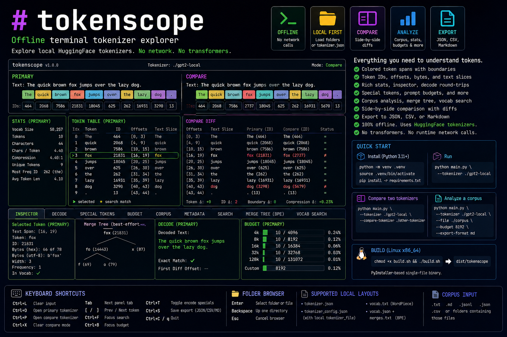

# tokenscope



`tokenscope` is an offline terminal tokenizer explorer for local HuggingFace tokenizer files. It loads tokenizer folders from disk, lets you type text interactively, and shows colored token spans, token IDs, vocabulary stats, token inspection, decode round-trip checks, special-token metadata, prompt and chat-template budgets, corpus analysis, batch prompt analysis, tokenizer pipeline debugging, tokenizer diffs, packing simulation, regression suites, Unicode inspection, RAG chunking, distribution summaries, cost estimates, repair suggestions, BPE merge reconstruction, vocabulary search, and optional side-by-side tokenizer comparison.

No runtime network calls are made. The app uses HuggingFace `tokenizers` directly and does not depend on `transformers`.

## Release

The v0.1.0 changelog is in [changelog_v0.1.0.md](changelog_v0.1.0.md).

Prebuilt Linux and Windows binaries are attached to GitHub Releases. macOS binaries are built by the macOS GitHub Actions runner or on a macOS host.

## Install

Use Python 3.11 or newer.

```bash
python -m venv .venv
source .venv/bin/activate
python -m pip install -r requirements.txt
```

On Windows PowerShell:

```powershell
python -m venv .venv
.\.venv\Scripts\Activate.ps1
python -m pip install -r requirements.txt
```

## Run

Load a tokenizer at launch:

```bash
python main.py --tokenizer ./gpt2-local
```

You can pass either a tokenizer directory or a direct `tokenizer.json` path:

```bash
python main.py --tokenizer ./gpt2-local/tokenizer.json
```

Compare two tokenizers at launch:

```bash
python main.py --tokenizer ./gpt2-local --compare-tokenizer ./other-tokenizer
```

Analyze a local corpus and set export defaults at launch:

```bash
python main.py --tokenizer ./gpt2-local --file ./corpus --budget 8192 --export-format md
```

Analyze a batch of prompt files at launch:

```bash
python main.py --tokenizer ./gpt2-local --batch ./prompts --budget 8192 --export-format html
```

Load a saved TokenScope project:

```bash
python main.py --project ./tokenscope_project.json
```

Run headless analysis for scripts or CI:

```bash
python main.py analyze --tokenizer ./gpt2-local --input-file ./prompt.txt --budget 8192 --export report.html --export-format html
```

If `--tokenizer` is omitted, `tokenscope` opens a folder browser inside the TUI. Interactive tokenizer loading selects folders only. CLI loading can use either folders or direct `tokenizer.json` paths.

Supported local tokenizer layouts include:

- `tokenizer.json`
- `tokenizer_config.json` with a local `tokenizer_file`
- `vocab.txt` for WordPiece tokenizers
- `vocab.json` plus `merges.txt` for BPE tokenizers

The corpus and batch browsers accept local `.txt`, `.md`, `.jsonl`, `.json`, and `.csv` files, plus folders containing those files.

## Keyboard Shortcuts

- `Ctrl+L`: clear input
- `Ctrl+O`: open or replace the primary tokenizer with the folder browser
- `Ctrl+P`: open or replace the compare tokenizer with the folder browser
- `Ctrl+X`: clear compare mode
- `Tab`: cycle bottom panel tabs
- `[` / `]`: select the previous or next token in the active token table
- `Ctrl+F`: focus token search
- `Ctrl+B`: focus prompt budget input
- `Ctrl+T`: toggle encode-special-tokens mode and re-tokenize
- `Ctrl+S`: save the current export as JSON, CSV, Markdown, or HTML based on the export selector
- `Ctrl+C` or `q`: quit

Folder browser controls:

- `Enter`: select the highlighted folder or supported corpus file
- `Backspace`: move the browser root to the parent folder
- `Esc`: cancel the browser when a primary tokenizer is already loaded

## Panels

- Token view: colored token spans, visible token boundaries, selected-token highlighting, search-match highlighting, and aligned token IDs
- Stats panel: vocab size, token count, character count, chars per token, compression ratio, unique token count, most frequent token ID, and average token length
- Token Table: index, token string, token ID, offsets, text slice, UTF-8 byte representation, selection, and search-match markers
- Compare Diff: offset range, text slice, primary token/ID, compare token/ID, and difference status
- Inspector: selected token text span, token string, ID, offsets, byte representation, display width, frequency, vocab membership, and per-token merge tree
- Decode: tokenizer decode output for the current token IDs, exact-match status, and first differing offset
- Special Tokens: added/special token IDs and flags, with an encode-special-tokens toggle
- Budget: built-in 4k, 8k, 16k, 32k, and 128k limits plus custom token limits
- Chat Budget: local HuggingFace `chat_template` rendering with editable message roles, optional generation prompt, rendered-token count, and budget use
- Corpus: local corpus totals, chars/token, top token IDs/strings, and longest tokenized lines
- Corpus Compare: primary-vs-compare corpus token deltas, chars/token deltas, and highest-difference files
- Batch: prompt-file token counts, budget status, compare-tokenizer deltas, percentiles, and longest prompts
- Project: save or load tokenizer paths, input text, chat messages, budget, corpus/batch paths, active tab, and export settings
- Tokenizer Diff: vocab, merge-rank, added-token, special-token, metadata, and component differences between primary and compare tokenizers
- Packing: head, tail, head+tail, and context-pack simulations against the active budget
- Regression: run JSON tokenization regression suites and add the current input as a new case
- Unicode: code points, Unicode names, categories, UTF-8 bytes, invisible/control/combining flags, and normalization changes
- RAG Chunking: token-window or separator chunk summaries with overlap, overflow, and wasted-budget counts
- Distribution: token-count percentiles, histogram buckets, and budget failure rates for corpus or batch summaries
- Cost: offline cost estimates from user-provided per-million-token pricing
- Repair: read-only tokenizer configuration and special-token repair suggestions, with optional patch-preview export
- Metadata: tokenizer model type, source path, vocab size, components, config files, and loaded tokenizer file
- Search: text substring, token substring, or exact token ID search over the current tokenization
- Merge Tree: BPE-only best-effort ASCII merge tree reconstruction from merge ranks, including byte-level BPE symbols
- Pipeline: normalized text, pre-tokenizer splits, model tokens, token IDs, and decoded text for the active input
- Vocab Search: substring search over tokenizer vocabulary

In Compare Mode, the input is shared. The primary and compare tokenizers update together, the token views are shown side by side, and the stats panel shows token count, compression, boundary, token, and ID deltas.

`Ctrl+S` exports the current primary tokenization. When Compare Mode is active, the export also includes both tokenizer metadata, both tokenization results, comparison summary metrics, and diff rows. CSV, Markdown, and HTML exports include token tables, compare diff rows, prompt and chat budget summaries, corpus summaries, batch summaries, corpus-compare results, pipeline details, and the new project, diff, packing, regression, Unicode, RAG, distribution, cost, and repair sections when present.

Headless `analyze` supports `--fail-on-budget` and `--fail-on-regression` for CI-style checks. It exits with code `2` when the requested check fails.

## Build

The shared PyInstaller spec is `tokenscope.spec`.

Linux x86_64 builds use Docker:

```bash
scripts/build-linux-docker.sh
```

On Windows hosts without Docker Desktop WSL integration, run the same Linux Docker build through PowerShell:

```powershell
.\scripts\build-linux-docker.ps1
```

macOS builds must run on a macOS host or CI runner:

```bash
scripts/build-macos.sh
```

Windows builds use PyInstaller from PowerShell:

```powershell
.\scripts\build-windows.ps1
```

Default output paths:

```text
dist/tokenscope-linux-x86_64
dist/tokenscope-macos-arm64
dist/tokenscope-windows-x86_64.exe
```

Docker cannot reliably produce native macOS PyInstaller binaries from Linux. Build macOS artifacts on macOS.

## GitHub Actions

- CI runs `python -m compileall .` and `python -m unittest discover -v`.
- Binary builds run for manual dispatches and `v*` tags.
- Tagged builds upload Linux, Windows, and macOS binaries as workflow artifacts and create or update the matching GitHub Release.

Headless analysis can be used in CI scripts:

```bash
python main.py analyze --tokenizer ./gpt2-local --input-file prompt.txt --budget 8192 --fail-on-budget
```
